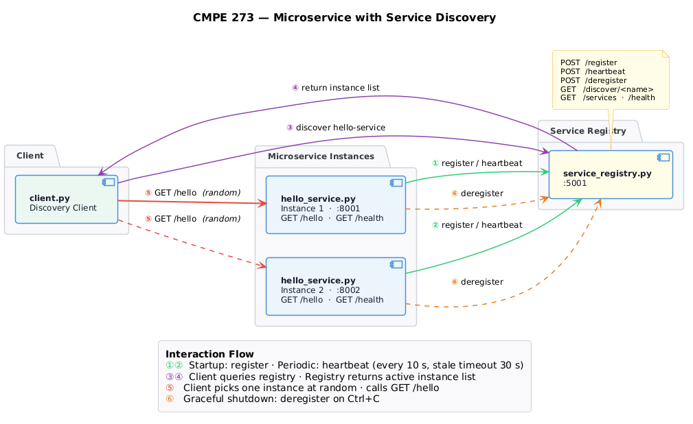
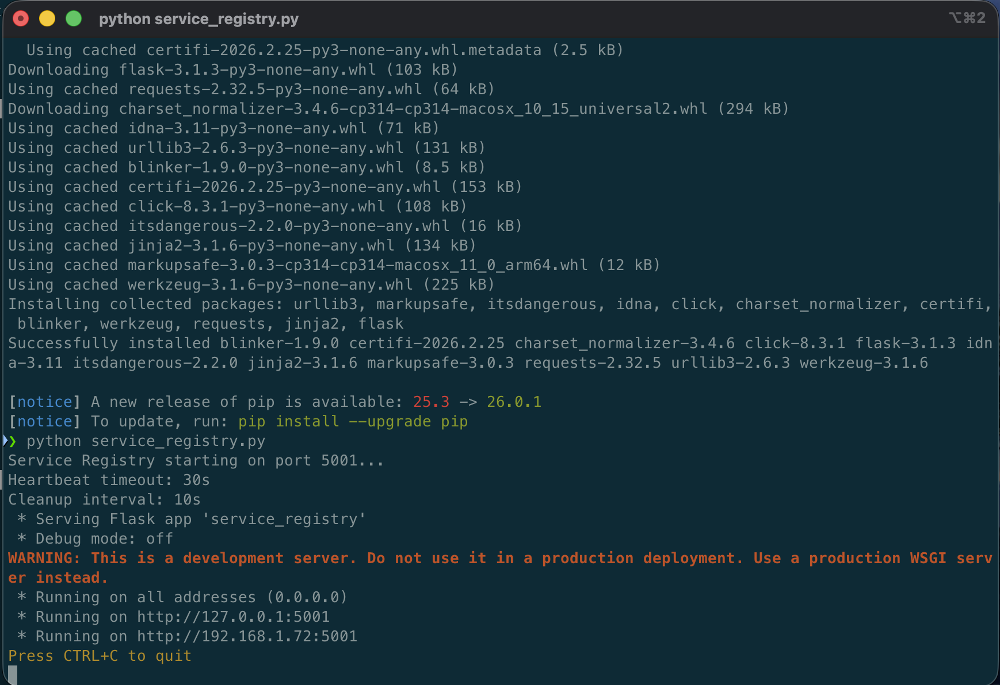
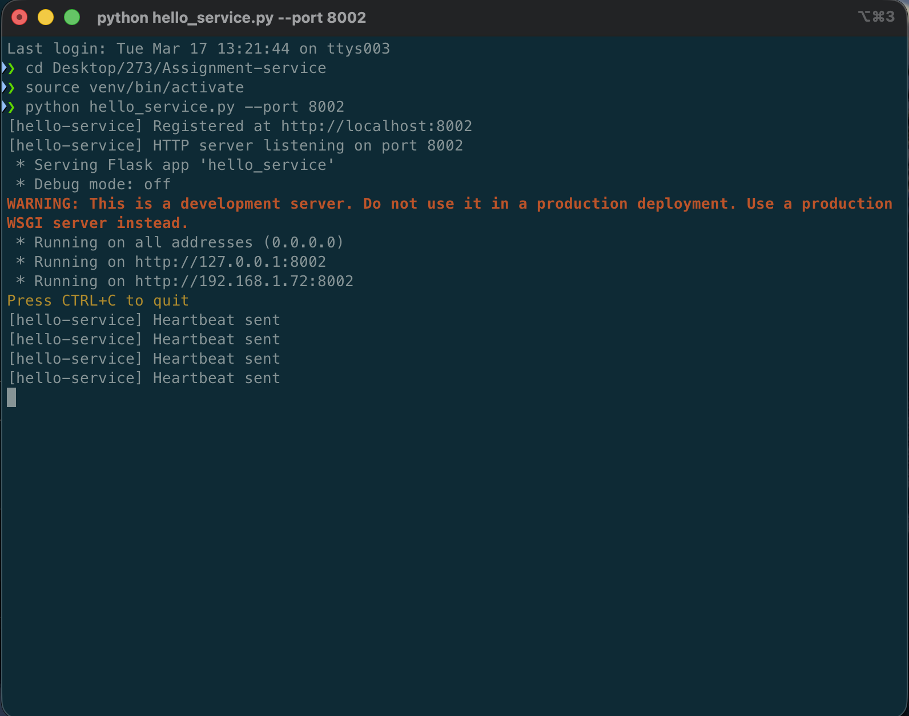
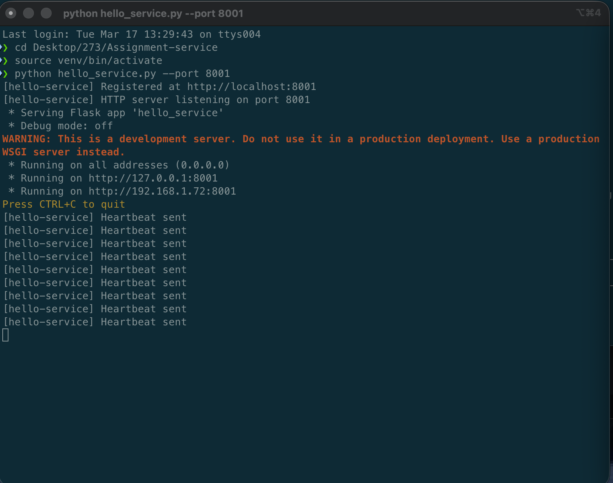
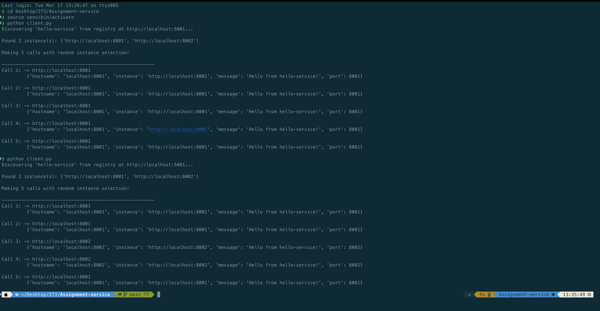
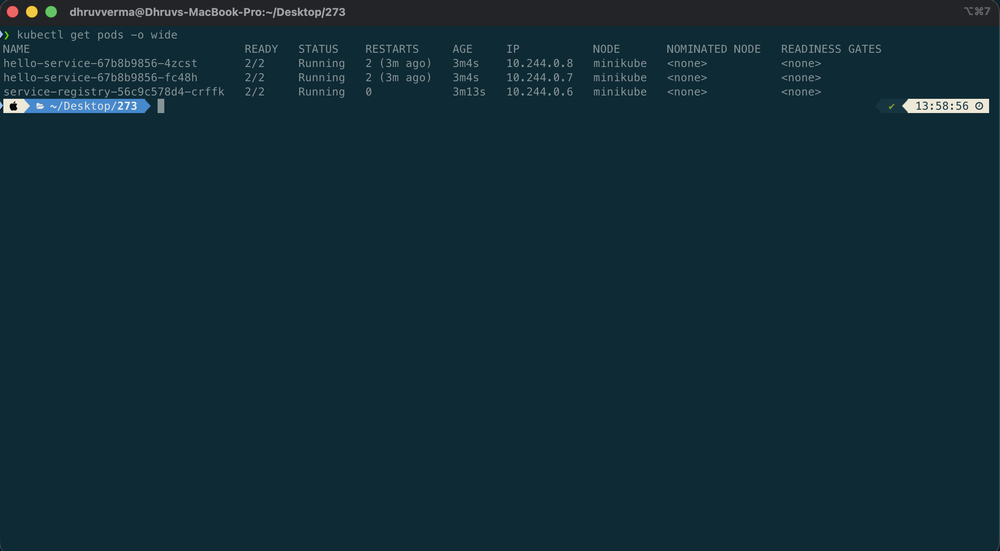
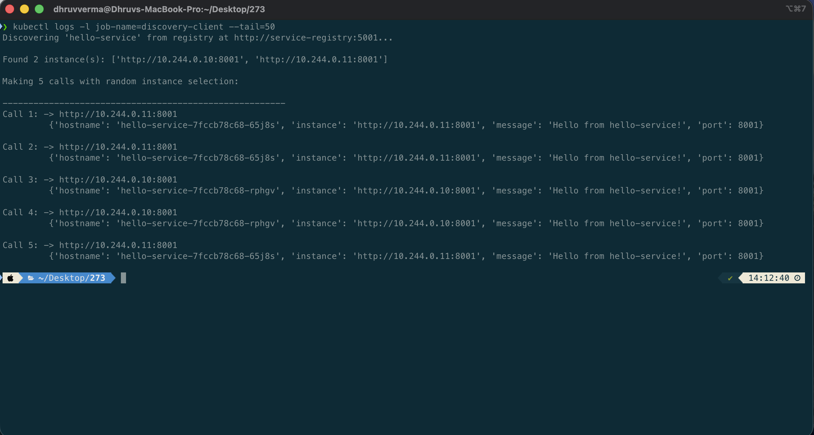
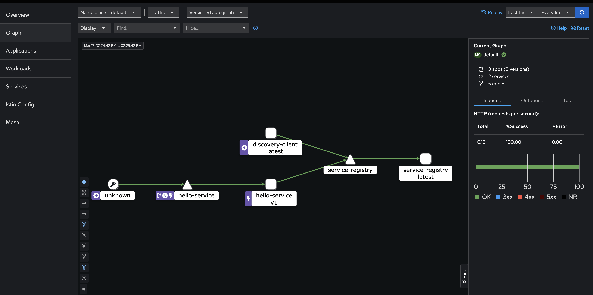

# CMPE 273 — Microservice with Service Discovery

Demonstrates client-side service discovery: two instances of a microservice register with a central registry; a client discovers them and routes calls randomly across instances.

## Table of Contents

- [Architecture](#architecture)
- [Quick Start](#quick-start)
- [Snapshots](#snapshots)
- [How It Works](#how-it-works)
- [API Reference](#api-reference)
- [Optional: Service Mesh with Istio](#optional-service-mesh-with-istio)
- [Demo Video](#demo-video)

## Architecture



```
┌──────────────────────────────────────────────────────┐
│                   Service Registry                   │
│                    (port 5001)                       │
│  POST /register  │  GET /discover  │  POST /heartbeat│
└────────┬─────────────────┬─────────────────┬─────────┘
         │ register/hb     │ register/hb     │ discover
         ▼                 ▼                 ▼
┌────────────────┐  ┌────────────────┐  ┌──────────────┐
│ Hello Service  │  │ Hello Service  │  │    Client    │
│  Instance 1    │  │  Instance 2    │  │              │
│  (port 8001)   │  │  (port 8002)   │  │ picks random │
│  GET /hello    │  │  GET /hello    │  │  instance &  │
└────────────────┘  └────────────────┘  │  calls /hello│
                                        └──────────────┘
```

## Quick Start

### 1. Install dependencies
```bash
pip install -r requirements.txt
```

### 2. Start the registry (Terminal 1)
```bash
python service_registry.py
```

### 3. Start service instance 1 (Terminal 2)
```bash
python hello_service.py --port 8001
```

### 4. Start service instance 2 (Terminal 3)
```bash
python hello_service.py --port 8002
```

### 5. Run the discovery client (Terminal 4)
```bash
python client.py
```

The client will discover both instances from the registry and make 5 calls, routing each one to a randomly selected instance.

## Snapshots

### 1. Registry startup


### 2. Service instances registering



### 3. Client — random instance selection


## How It Works

1. **Registration** — each service instance calls `POST /register` on startup with its name and address.
2. **Heartbeat** — instances send `POST /heartbeat` every 10 seconds; the registry removes instances that stop sending after 30 seconds.
3. **Discovery** — the client calls `GET /discover/hello-service` to get the list of active instances.
4. **Random routing** — the client picks an instance with `random.choice` and calls its `/hello` endpoint directly.
5. **Deregistration** — on shutdown (Ctrl+C), instances call `POST /deregister` to remove themselves cleanly.

## API Reference

| Method | Endpoint | Description |
|--------|----------|-------------|
| POST | `/register` | Register a service instance |
| GET | `/discover/<service>` | Get active instances |
| POST | `/heartbeat` | Update liveness |
| POST | `/deregister` | Remove an instance |
| GET | `/services` | List all services |
| GET | `/health` | Registry health check |

## Optional: Service Mesh with Istio

In the base implementation, our `client.py` handles discovery by querying the custom registry and picking an instance. With a **service mesh**, this shifts to the infrastructure layer — the client calls a stable DNS name and Istio routes traffic transparently through Envoy sidecar proxies.

```
App  ──▶  Envoy Sidecar  ──▶  Service Mesh  ──▶  hello-service pod
```

### Prerequisites

- [Minikube](https://minikube.sigs.k8s.io/docs/start/) >= 1.32
- [kubectl](https://kubernetes.io/docs/tasks/tools/)
- [istioctl](https://istio.io/latest/docs/setup/getting-started/) >= 1.20
- Docker

### Deploy

```bash
chmod +x deploy-mesh.sh
./deploy-mesh.sh
```

Or manually:

```bash
# 1. Start Minikube and install Istio
minikube start --memory=4096 --cpus=2
istioctl install --set profile=demo -y
kubectl label namespace default istio-injection=enabled --overwrite

# 2. Build image inside Minikube's Docker daemon
eval $(minikube docker-env)
docker build -t service-discovery:latest .

# 3. Deploy
kubectl apply -f k8s/registry.yaml
kubectl apply -f k8s/hello-service.yaml
kubectl apply -f k8s/istio-traffic.yaml

# 4. Run the discovery client
kubectl apply -f k8s/client-job.yaml
kubectl logs -l job-name=discovery-client --tail=50
```

### What the mesh adds

| Feature | Custom Registry | Istio Service Mesh |
|---------|----------------|-------------------|
| Discovery | Client queries registry | K8s DNS + Envoy |
| Load balancing | `random.choice` in client | Envoy (L7, configurable) |
| Retries / timeouts | Manual in client code | Declarative VirtualService |
| mTLS | None | Automatic (ISTIO_MUTUAL) |
| Observability | Print statements | Kiali, Jaeger, Prometheus |

### Verify sidecar injection

```bash
kubectl get pods -o wide
# Each hello-service pod should show 2/2 READY (app + istio-proxy)
istioctl dashboard kiali   # visual mesh topology
```

### Screenshots

#### Pods with Istio sidecar injected (2/2 READY)


#### In-cluster client job output


#### Kiali mesh topology


## Demo Video

[Download / Watch Demo Video](https://github.com/dhruv12304/CMPE273-Service-Discovery-Assignment/releases/download/v1.0/DemoVideo.mp4)
